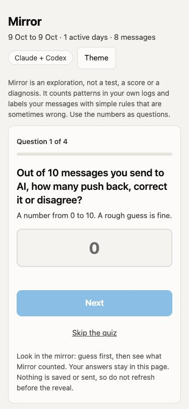
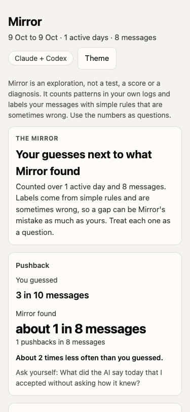

# Mirror

**A local, read-only look at how you work with AI.** Mirror reads your own Claude Code, Codex and Cursor session logs on your computer and shows you how your day went: what you asked, when you pushed back, when you just said "ok", how much the AI did between your messages.

It is an **exploration**, not a test, a score or a diagnosis. The numbers are questions to ask yourself.

[](https://github.com/nicopalazzo/mirror/actions/workflows/test.yml)

<p>
  
  
</p>

*The one-time quiz on a first report, then the reveal. Screenshots use synthetic data.*

## Quick start (about 2 minutes)

You need Python 3.8 or newer, and at least a few days of Claude Code, Codex or Cursor use.

1. Download the zip from the [latest release](https://github.com/nicopalazzo/mirror/releases/latest) (or `git clone https://github.com/nicopalazzo/mirror`) and unzip it.
2. **Mac:** double-click `Mirror.command`. **Windows:** double-click `Mirror.bat`. Your computer will warn that the file is unsigned the first time; the steps are under [Easiest: double-click](#easiest-double-click).
3. Read the list of what Mirror will read, and answer `y` if you agree.
4. On a first report you get a 4-question quiz before any numbers. Then the report opens in your browser.

Nothing leaves your computer. Mirror has no network code.

## Your data never leaves your computer

- **No network code.** Mirror imports no networking library. A test fails if one is added.
- **Nothing to install.** Python 3.8 or newer, standard library only. Mirror checks your version and tells you what to do if it is too old.
- **It opens session files only:** `~/.claude/projects/*/*.jsonl`, `~/.codex/sessions/**/rollout-*.jsonl` (plus `~/.codex/archived_sessions`) and `~/.cursor/projects/*/agent-transcripts/*/*.jsonl`. It never opens credentials, settings, MCP configuration, canvases, subagent transcripts or databases in those folders. A test checks this against decoy files.
- **First run asks for permission** and lists exactly what it will read.
- **Your messages are not kept, not even in memory.** Each one is labelled by simple rules the moment it is read and only its type and length survive. Reports and the share card contain numbers only, no message text. (The report page does show your own notes, so send the share card, not the report file.)
- **Read the [threat model](THREAT-MODEL.md)** for who Mirror protects you from, how to check each protection, and what it does not cover.
- **It writes only to two folders:** `~/.mirror` (settings and your notes) and `~/Mirror` (report pages, a visible folder chosen so iCloud and OneDrive do not sync it by default). Delete everything with `mirror.py forget`; it removes only Mirror's own report files, never other files you keep in `~/Mirror`.
- Reading the code takes ten minutes. Start with `mirror_core/readers.py`.

## Easiest: double-click

1. Get the folder onto your computer (download the zip from GitHub and unzip it, or `git clone`).
2. **Mac:** double-click **`Mirror.command`**. **Windows:** double-click **`Mirror.bat`**.
3. A small window opens. The first time, it lists what Mirror will read and asks `y/N`. It then shows how today went, asks whether that matched your day, and opens the report in your browser.
4. **To open the report again later,** double-click **`Mirror Report.command`** (Mac) or **`Mirror Report.bat`** (Windows). It rebuilds the report and opens it without asking anything. Reports are also kept in a normal folder called **`Mirror`** in your home folder, so you can find them in Finder or Explorer.

The files are not signed, so your computer will warn you the first time:
- **Mac:** "cannot be opened because it is from an unidentified developer". Right-click the file, choose **Open**, then **Open** again. If that option is missing: System Settings, Privacy & Security, scroll down, **Open Anyway**. A zip download can also lose the file's "runnable" flag; if double-clicking does nothing, use the terminal method below or `git clone`.
- **Windows:** SmartScreen says "Windows protected your PC". Choose **More info**, then **Run anyway**.
- **No Python?** Both launchers say so. Install Python 3.8+ from python.org (on a Mac without it, macOS may offer to install developer tools; that also works).

Both launchers only run `mirror.py`. They download nothing, and a test checks that.

## Run it in a terminal

You need Python 3.8+ (check with `python3 --version`, or `py --version` on Windows). Then, in the `mirror` folder:

| | macOS / Linux | Windows |
|---|---|---|
| How your day went | `python3 mirror.py day` | `py mirror.py day` |
| Last 7 days | `python3 mirror.py week` | `py mirror.py week` |
| HTML report (works offline) | `python3 mirror.py report --open` | `py mirror.py report --open` |
| What Mirror can see | `python3 mirror.py sources` | `py mirror.py sources` |
| What a number means | `python3 mirror.py explain challenge` | `py mirror.py explain challenge` |
| Numbers only, to share if you choose | `python3 mirror.py share-card` | `py mirror.py share-card` |
| Something looks wrong: versions and counts, no text | `python3 mirror.py doctor` | `py mirror.py doctor` |
| Record whether a day's numbers matched (used by the skill) | `python3 mirror.py feedback --match partly` | `py mirror.py feedback --match partly` |
| Read from a non-default folder | `python3 mirror.py day --cursor-dir /path/to/.cursor` (also `--claude-dir`, `--codex-dir`) | same with `py` |
| Delete everything Mirror stored | `python3 mirror.py forget` | `py mirror.py forget` |

If `py` is not found on Windows, try `python`. Use `--yes` after the command to accept the first-run notice without being asked.

## Nudges inside Claude Code (plugin)

Optional. After a long run of messages without a question or pushback (30 by default), Mirror holds that one message and shows you one line in its place, in the chat. Claude never sees it. Claude Code frames it as "A hook blocked your prompt"; your message stays in the input box, so Enter sends it. You answer with `/mirror:check` (a 2-minute check of the last answer), `/mirror:snooze`, or `/mirror:off`. It is off until you type `/mirror:on`, and it steps back on its own if you keep ignoring it.

Install (Claude Code 2.1 or newer):

```
claude plugin marketplace add nicopalazzo/mirror
claude plugin install mirror@mirror
```

Then start a new session and type `/mirror:on`. `/mirror:status` shows how you have answered. `/mirror:report` builds the HTML report from your own logs and opens it in your browser (the page shows your own notes, so do not share your screen with it open).

Two optional settings, from a terminal in the `mirror` folder: `python3 mirror.py nudge rule ratio` fires on the share of your last 20 messages without a question or pushback instead of an unbroken streak (`scripts/calibrate_nudge.py` shows how often each rule would have fired on your own logs). `python3 mirror.py nudge holdback 0.5` holds back half the nudges at random, so `/mirror:status` can compare what you did with and without one. Remove with `claude plugin uninstall mirror@mirror`. A Codex plugin is below; a Cursor plugin is planned. They are packaged separately because each tool loads hooks differently.

## Nudges inside Codex (plugin)

Same nudge, packaged for Codex (`plugins/mirror-codex`). From the `mirror` folder:

```
codex plugin marketplace add .
codex plugin add mirror
```

Restart Codex, then **review and trust Mirror's hook** (Codex asks the first time; `/hooks` shows it). Invoke the skills as `$mirror:on`, `$mirror:status`, `$mirror:snooze`, `$mirror:check`, `$mirror:off`, `$mirror:report` (builds the HTML report and opens it; on a new install it starts with the one-time quiz). It is off until you turn it on. Needs a Codex version with plugin hooks; untested on Windows.

## Use it from Claude or Codex (no terminal typing)

If you already work in Claude Code or Codex, install Mirror as a skill and just ask "how did my day go with AI?" (or type `/mirror`).

| | Claude Code | Codex |
|---|---|---|
| Install (one command) | `git clone https://github.com/nicopalazzo/mirror ~/.claude/skills/mirror` | `git clone https://github.com/nicopalazzo/mirror ~/.codex/skills/mirror` |
| Windows folder | `%USERPROFILE%\.claude\skills\mirror` | `%USERPROFILE%\.codex\skills\mirror` |

Restart the tool after installing. The skill asks your permission first and tells you that what Mirror prints will appear in the chat, so your AI provider sees the numbers (never your messages). If you would rather keep everything local, run it in a terminal as above.

## The four numbers

1. **Challenge rate:** how often you push back or ask a question, against how often you approve.
2. **Approvals:** share of short agreements, and how many came within 15 seconds of an AI turn that changed files.
3. **Delegation depth:** AI actions per message you sent, and the longest run of file changes without a message from you.
4. **Focus:** sessions, projects, tools and active minutes in the day.

Each has a plain "what it cannot tell you". Run `explain` to read it. Comparisons are always with **your own** earlier days, never with other people.

At the end of `day`, Mirror asks whether the numbers match how the day felt. That answer stays on your computer. `share-card` prints numbers only (add `--include-note` to add your notes), and Mirror sends nothing: you decide whether to pass it on.

## Limits, said plainly

- **Message labels are rules, not understanding.** They work in English and French and are wrong some of the time. On one person's 154 hand-labelled messages, the rules matched the exact label 58% of the time, and got the decision the nudge uses (question or pushback vs anything else) right 86% of the time (a small check, one labeller). Treat the split as rough.
- **Only tools whose logs Mirror can read are counted:** Claude Code, Codex and Cursor. Web chats (claude.ai, chatgpt.com) leave no local log.
- **Cursor has no reply times.** Its logs put a time only on your messages, so "quick approvals" cannot be measured for Cursor and active time is approximate. The report says so. I have checked the Cursor reader against one person's Mac logs only; the folder is `~/.cursor` on every system, but Windows layouts are unverified.
- **Claude Code deletes old sessions after about 30 days** unless you raise `cleanupPeriodDays` in its settings, so history is short.
- **"Quick approval" is an arbitrary 15-second line.** Change it with `--quick-seconds`.
- **Different Python or OS versions:** the code is checked for Python 3.8 syntax and the automated tests run on Python 3.8 to 3.13 on Mac, Linux and Windows. If a setup still fails, `doctor` prints what is needed to fix it, without any of your text.
- **Mac and Linux are tested here; Windows is covered by the automated tests in `.github/workflows/test.yml` but has not been tried by hand.** Tell us what breaks.

## Tests

```
python3 -m unittest discover -s tests -v
```

The tests use synthetic logs only (`tests/make_fixtures.py`). There are no real conversations in this repository.

## Status

Version 0.3.1, exploratory (see the [changelog](CHANGELOG.md)). Licence: [PolyForm Noncommercial 1.0.0](LICENSE): free for personal, educational and other noncommercial use; commercial use needs the author's permission.
